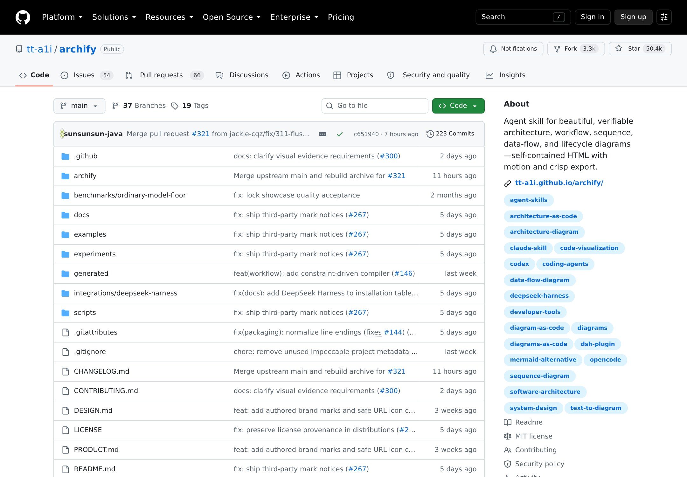
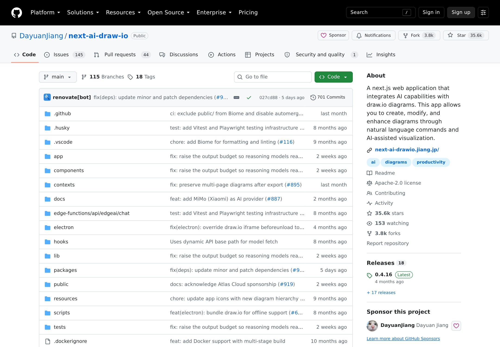
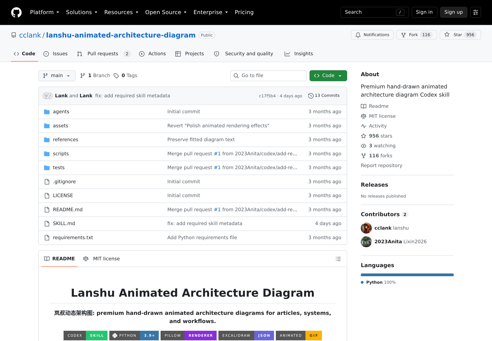
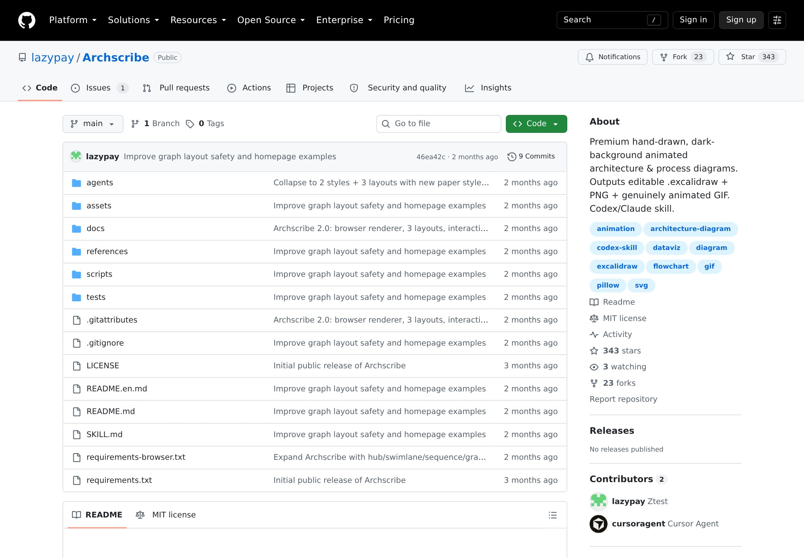

# 架构图"活"了:Archify 五万星,和一份真伪参半的网红清单

最近微信群里又在传一份"动态架构图工具盘点",从 Archify、ByteDiagram 到 morffy,列得整整齐齐,连星数都配好了。

作为每天跟代码仓库打交道的 AI Native Coder,我第一反应是挨个去 GitHub 验证。结果有点意外:这份清单里,真正存在的仓库不到一半。Archify 是真的,而且已经五万星,是目前 Agent Skill 生态里最头部的一档;但 dynamic-archify、morffy 这些名字,搜遍 GitHub 连影子都没有。

更搞笑的是,清单给 Archify 标的星数是"35.7K",我今天实测是 50,362。35.7K 这个数字,更像是隔壁 next-ai-draw-io 的星数——写这份清单的 AI,大概率把两个仓库搞混了。

今天这篇,我用真实仓库主页截图说话,把"活的"和"编的"分开,再聊聊架构图为什么突然"动"起来了。文中所有星数,均为 2026 年 9 月 6 日我在 GitHub 实时查询。

---

## 01 网红清单里的真伪对照

先把查证结果摊开,每一条都有据可查:

**Archify(tt-a1i/archify)** — 真,50,362 星,MIT。Agent Skill,Node.js 渲染与校验系统。
**next-ai-draw-io(DayuanJiang)** — 真,35,646 星。Next.js + draw.io 的 AI 对话画图应用。
**beautiful-mermaid(lukilabs)** — 真,11,038 星。Craft 团队出品的 Mermaid 美化渲染。
**lanshu-animated-architecture-diagram(cclank)** — 真,956 星。手绘黑板风动图 Codex Skill。
**Archscribe(lazypay)** — 真,343 星。手绘风深色底动态图,输出可编辑 Excalidraw 源文件。
**archflow(rafaelolsr)** — 真,但只有 28 星,README 很薄,谈不上"主流"。
**dynamic-archify** — 查无此仓库。
**morffy** — 查无此仓库。
**ByteDiagram** — 没有对应的开源仓库。
**konva-architecture-canvas** — 存在,但 2 星、无描述,所谓"47+ 预置 AWS/Azure 组件"查无实据。

一份清单真伪参半,只能说明它根本不是作者实测的,大概率是 AI 生成之后被转手传播。避坑方法其实很简单:别信转发的工具榜,自己去 GitHub 看三点——仓库真实星数与更新时间、最近的 commit 是否活跃、README 能不能给出可复现的安装命令。

## 02 Archify 凭什么冲到五万星

Archify 的 README 第一句就把事情说清楚了:把代码仓库或系统描述,变成一张精致的、可交互的系统地图,直接在对话里完成。

它真正的关键在架构设计:Agent 先产出 typed JSON IR(类型化的中间表示),Archify 再把 JSON 确定性地编译成 HTML/SVG。图不是"画"出来的,是"算"出来的。这意味着:

- 支持 architecture、workflow、sequence、data-flow、lifecycle 五种图
- 四套预设风格,明暗主题一键切换,内置品牌图标,动效克制
- 改架构不用推倒重来,改 JSON 重新编译就行,可维护性来自这个抽象层
- 可以在合并代码前,对两张架构快照做 Before / Delta / After 三段式对比,精确到哪些节点新增、删除、移动、改路由
- 生成的图可以检索节点、溯源到经过版本校验的源码,播报导览故事时不编造拓扑

最打动我的是它官网的 Proof Lab:里面的演示 artifact 全是真实生成的,不是产品 mockup。它还拿 mco-org/mco 这个公开仓库做了一张完整的运行时架构图,从源码一路追到路由。导出支持单文件 HTML、PNG、SVG、WebM,甚至带 1200×630 的分享卡片。

安装只要一行:npx skills add tt-a1i/archify -g。而且不需要仓库也能用,在对话里描述系统就行。

五万星里大概有一半是"所见即所得"拉来的。图能点、能查、能讲,这等于把架构图从"静态资产"变成了"可交互的事实"。

## 03 名单上其余真仓库,挨个看一眼

**next-ai-draw-io(35,646 星)** — 熟悉的 draw.io 画布,加上 AI 对话生成和修改。老 draw.io 用户几乎没有学习成本,这是它星数能到三万五的原因。

**beautiful-mermaid(11,038 星)** — Craft 团队出品,Mermaid 的美化渲染层。六类图,SVG 和 ASCII 双输出,十五套内置主题,零 DOM 依赖,面向的是 AI 编程助手——让 Mermaid 在终端里也能好看。它的底座 Mermaid 本体(mermaid-js)今天 90,121 星,"图表即代码"这个流派的老祖宗。

**lanshu-animated-architecture-diagram(956 星)** — Codex Skill,手绘黑板风动画 GIF,宣称纯本地渲染,不依赖外部 API 和浏览器。适合做演示动图,但它只认 JSON 输入,学的是 Claude 那套结构。

**Archscribe(343 星)** — 同样手绘风,深色底,输出可编辑的 Excalidraw 源文件加真会动的 GIF,panorama、swimlane、graph 三种布局。

**archflow(28 星)** — 方向其实最正:真的去读你的代码库,识别真实组件和数据流再生成。但星数和 README 厚度都说明它还太早,先观望。

## 04 分析对比:它们根本不在同一条赛道

把工具并排比星数是最没意义的事,拆开看需求才清楚:

**要"图跟代码同源、能维护、能验证",选 Archify。** 它把 JSON IR 当中间层,架构改动变成数据改动,能进仓库、能 diff,这是目前唯一"工程化"的解法。

**要"熟悉的画布加对话",选 next-ai-draw-io。** 学习成本最低,适合已有 draw.io 习惯的团队。

**要"让 Mermaid 好看点",用 beautiful-mermaid。** 这是最小的一步改造,不动你现有的图表代码。

**要"分享一张手绘风动图",看 lanshu 或 Archscribe。** 图好看是第一诉求,可维护性其次。

**要"AI 真读懂我的仓库再画",archflow 方向对但还小,建议盯它的进展,先别上生产。**

判断标准其实只有一条:这张图是不是"代码资产"。能不能进 Git、能不能被下一次对话更新、会不会因为你改了一行配置就作废。按这个标准,Archify 是唯一把话说完整的,这也是为什么它能从这场混战里跑出来。

## 05 写在最后

架构图正在从"图形资产"变成"代码资产"。

手工拖框的时代没有死,但 AI 时代的第一张架构图,大概率是 agent 画的。它跟代码同源,跟着代码一起变,而不是躺在某个画布文件里等人手动更新。

工具会迭代,名字会过气,但"图即代码"这个方向,Archify 已经用五万星投了票。下次再看到转发的工具清单,记得先查,再收藏。

---

**参考资料(全部为 2026-09-06 实测数据):**

github.com/tt-a1i/archify(50,362 星)
github.com/mermaid-js/mermaid(90,121 星)
github.com/DayuanJiang/next-ai-draw-io(35,646 星)
github.com/lukilabs/beautiful-mermaid(11,038 星)
github.com/cclank/lanshu-animated-architecture-diagram(956 星)
github.com/lazypay/Archscribe(343 星)
github.com/rafaelolsr/archflow(28 星)
