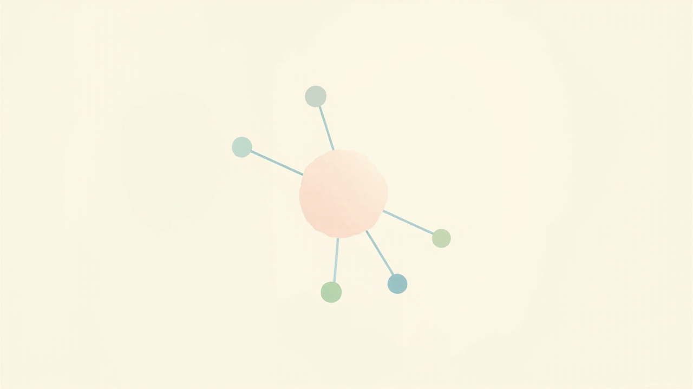
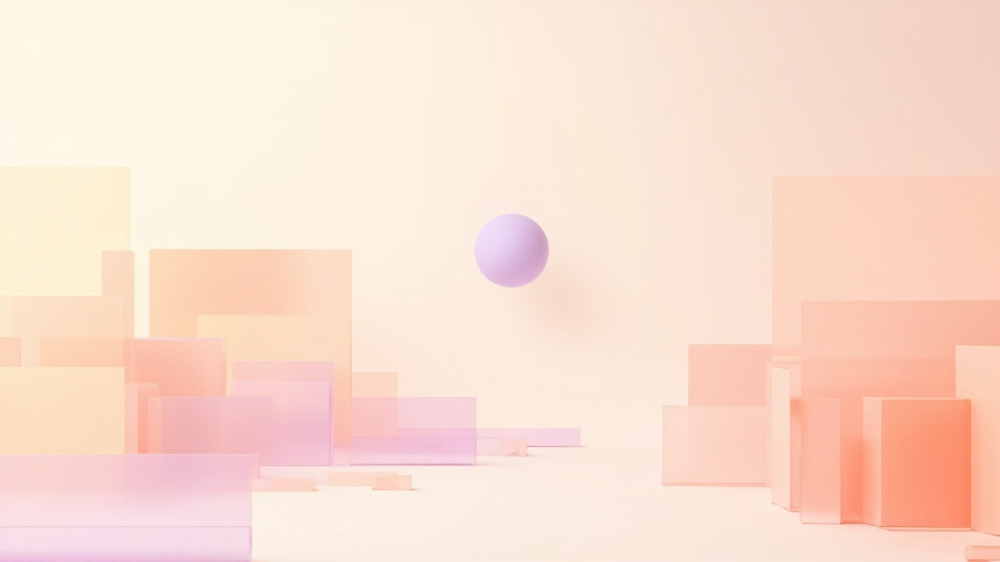
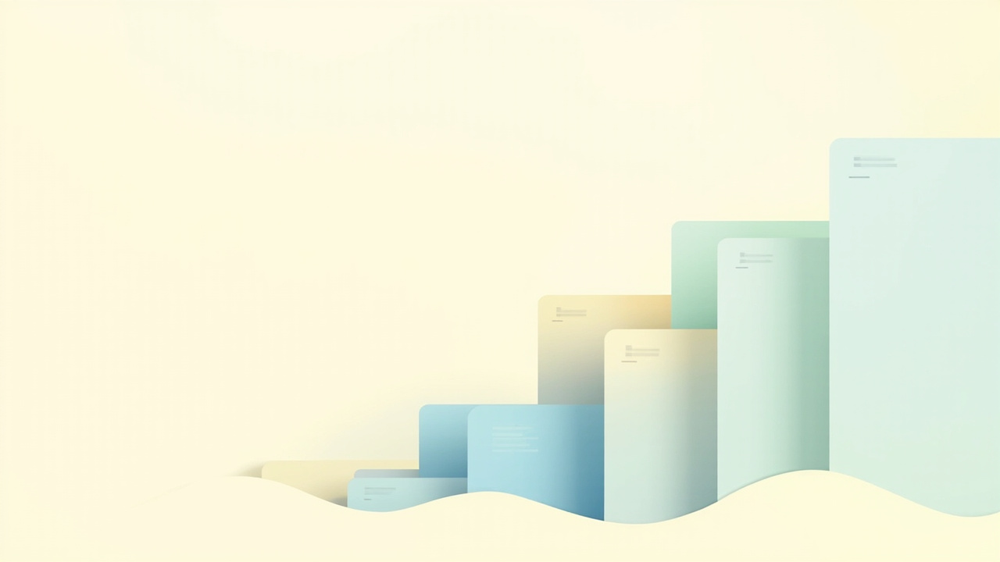

# 一天4700颗星——Understand-Anything证明「代码理解」正在从阅读变成导航

先列几个数字，你自己感受一下。

Understand-Anything，一个把代码仓库变成交互式知识图谱的工具，今年3月15日才创建，到现在不到两个半月，39,702个Star。不是慢热型增长——5月24日那天，单日涨了4700颗星，冲上GitHub Trending榜首。

同期，CodeGraph给AI编程助手做预索引知识图谱，29,766星。DeepWiki做AI生成代码维基，16,591星。Google不动声色上线了CodeWiki，背后是Gemini模型。智谱推出ZRead，阿里Qoder集成Repo Wiki。

七个产品，方向各异，但全在干同一件事：让人类不再一行行读代码。

这事，得往下再挖一层。

---

我刚入行那会儿，"理解一个代码库"的标准答案就是：坐下来，从头开始读。先看README，再看package.json搞清楚依赖，顺着入口文件一路往下追，Ctrl+Click点到手抽筋。

那时候我们对"代码理解"的想象，本质上是一种阅读行为。就像看一本书——你得按顺序翻页，自己构建心理模型，在脑子里画一张模糊的依赖关系图。这张图随时可能塌方，因为你漏了一个import。

但2026年，事情变了。

一个把代码"地图化"的工具，两个半月3.9万星，单日4700星。这不是某一个工具的成功。这是**代码理解正在从"阅读"变成"导航"**的信号。

而且你仔细看这七个产品的出现顺序，会发现一个更深的规律：它们不是在竞争，而是在分化。每个产品对应的是代码理解场景中不同的"角色"。

## Understand-Anything：代码的Google Maps

Understand-Anything的产品哲学写在README第一行："Graphs that teach > graphs that impress." ——能教你的图，比只是好看的图重要。

市面上把代码可视化的工具不少，但它们大多在做一件事：把复杂代码画成一张更复杂的关系图，然后说"看，你的代码就是这么复杂"。这种图除了让你焦虑，没什么用。

Understand-Anything干的事不一样。它不给你看复杂度，它给你画地图。

装完插件（Claude Code Plugin，支持Codex、Cursor、Copilot、Gemini CLI等14个平台），跑 `/understand`，一个多Agent管线开始工作：project-scanner扫文件结构，file-analyzer提取函数/类/依赖，architecture-analyzer识别架构层级，tour-builder自动生成导览路线。跑完后你的代码库变成了一张可交互的知识图谱。

每个文件、函数、类、模块都是节点。拖拽，缩放，搜索。点一下任意节点，右边弹面板，用自然语言解释这段代码干什么、和谁有关系。更狠的是语义搜索——你不需要知道函数名，直接问"哪块管身份验证？"，它找到相关节点，高亮，告诉你整个认证链路怎么走的。

这已经不是"阅读代码"。这是"探索地图"。

技术上有一个非常聪明的取舍：Tree-sitter负责结构解析（确定性的、可复现的），LLM负责语义理解（摘要、标签、导览路线）。结构的归结构，理解的归理解。同一个代码库跑两次，结构层结果完全一致，语义层随模型升级越来越准。这对经常重构项目的人来说很关键——你不需要每次改完代码就重新理解全局，图谱是稳定的，变动的只是语义层的摘要描述。

## CodeGraph：给Agent装了个搜索引擎

Understand-Anything解决的是人怎么理解代码。CodeGraph解决的是AI怎么理解代码。

两个完全不同的赛道，但逻辑相通。

创始人做了组对比实验：7个真实开源项目，同一个架构问题，Claude Code在"有CodeGraph索引"和"没有"两种条件下跑。

结果：平均节省35%成本，少吃57% tokens，快46%，减少71%的工具调用。VS Code级别的仓库，token消耗直接砍掉78%。

没有CodeGraph的时候，Claude Code想回答"扩展主机怎么和主进程通信"这种问题，得先派Explore Agent出去，grep搜文件、glob找目录、Read读源码，每一步都在烧token。一个大型仓库可能要跑50多次工具调用才找到答案。有索引之后呢？Agent直接查索引，两步定位关键文件，读完就答完了。

CodeGraph是100%本地的。SQLite存索引，文件监听器自动增量更新，不需要API Key，代码不出你的机器。20+语言，14个Web框架路由识别，还专门处理了iOS/React Native/Expo的跨语言桥接——这些静态解析器吃瘪的场景，它用启发式规则加LLM一起搞定了。

🧐 有个细节值得注意：CodeGraph的作者把benchmark数据公开在了GitHub上，你可以拿自己的项目跑一遍做验证。这不是那种"我们测试了但我们不告诉你怎么测的"玩法。这种透明度本身就是一个产品信号——对自己的基准有信心。

## DeepWiki：当代码库变成维基百科

DeepWiki做的事很直观：输入GitHub仓库地址，等一会，输出完整代码维基——架构概览、模块文档、函数说明、类图、依赖图。可以浏览，也可以自然语言提问。

主产品 deepwiki.com 是Devin团队（Cognition AI）做的，不开源。但开源社区很快搞了 deepwiki-open，Python写，支持Ollama本地模型，自托管，16,591星。

DeepWiki跟Understand-Anything有本质区别：一个输出的是"图"，一个输出的是"文档"。这是人类信息处理的两个通道——视觉空间处理和语言序列处理——在代码理解领域的投影。有意思的是，这两个方向各自的用户群几乎不重叠。看图派觉得文档太慢；读文档派觉得图太碎片化。

而且DeepWiki有一个隐藏价值：你可以把它生成的文档当成技术债审计报告。一个仓库如果DeepWiki生成的架构文档三句话就讲完了，说明这个仓库要么极简要么极乱——大概率是后者。

## Google Code Wiki：扫地僧入场

如果说DeepWiki是个勤奋的实习生，Google这个CodeWiki就是坐镇藏经阁的扫地僧。

CodeWiki（codewiki.google）底层跑Gemini。Gemini的超长上下文决定了它特别适合分析大型仓库——你把Kubernetes扔进去，它直接生成一个看起来"我很贵"的在线文档站。

但真正让人服气的是它是个画图狂魔。文档里自动穿插类图、时序图、架构流转图。新手看代码一行一行看，老师傅看的是"脉络"。CodeWiki直接带你打通任督二脉——不只是告诉你这段代码做什么，还通过图表说清楚"数据从A传到B，经过C处理，存到D"。

目前Google已对海量热门开源仓库完成预索引。不久之后将支持私有仓库——到那时候，什么上古项目、屎山代码，扔进去就给你嚼碎了。

跟DeepWiki比：DeepWiki更轻量，开源生态丰富，适合中小项目和团队文档协作；CodeWiki背靠Gemini的上下文能力，大型复杂项目的分析深度更胜一筹，图也画得更全。两个不是替代关系，是项目规模决定的自然选择。

另外说一句：Google这种"低调上线不宣传"的打法，反而让人更感兴趣。如果Gemini 3发布时大张旗鼓，CodeWiki却安静得像个扫地僧——说明Google内部对这个产品有足够的底气，不需要发布会背书。

## 国产力量：ZRead与Qoder RepoWiki

智谱的ZRead走"代码变文档"路线，但比DeepWiki多了一个维度——它是CLI工具。

`zread generate` 一条命令，AI自动分析本地代码仓库，生成结构化Wiki文档，带内置阅读器。支持Homebrew、npm、winget安装，内置智谱Coding Plan和OpenAI等提供商。github.com/ZreadAI/zread_cli，97星，还在早期。

但别被星数骗了。ZRead的优势不在功能丰富度，在中文场景。GLM-4.5对中文代码注释、中文技术文档、国内流行的技术栈的理解，比GPT和Claude系列更自然。如果你维护的项目文档全是中文写的，ZRead可能比DeepWiki更懂你。

Qoder走的路线不同。它是阿里推出的AI编程平台，Repo Wiki是其中一个功能——代码库文档化。跟前面几个独立工具不同，Repo Wiki嵌入IDE，不用切换上下文。写代码的时候Wiki就生成好了。团队版¥300/席位/月。

这两家代表了一种很中国的产品逻辑：不追求"做一个全世界最好的代码理解工具"，而是把代码理解做成基础设施。ZRead是要让代码文档像npm install一样简单；Qoder是要让文档化成为写代码时的默认行为。就像移动支付在中国是水电煤一样的存在，代码文档化正在变成编程的基础能力。

## 产品矩阵

以下按定位分类，附来源和我个人的体验判断。这不是产品评测，是一个极客划的一张地图。

**交互式知识图谱型**

Understand-Anything
定位：把代码库变成可拖拽、可搜索、可提问的交互地图
优势：体验最惊艳，语义搜索是杀手功能，14平台支持
短板：需要装插件，不适合纯CLI用户；大仓库首次索引慢
来源：github.com/Lum1104/Understand-Anything
判断：代码探索者品类里最好的产品。如果你习惯在IDE里看代码，它把IDE变成了地图App。

**Agent上下文增强型**

CodeGraph
定位：给AI编程助手提供预索引代码知识图谱
优势：35%更便宜、71%更少工具调用，100%本地，20+语言
短板：不面向人类直接使用，配合Claude Code/Cursor等Agent
来源：github.com/colbymchenry/codegraph
判断：Agent赛道目前最优解。日常用AI写代码的话，装上后体感差异明显——Agent不再瞎转了。

**AI生成文档型**

DeepWiki / DeepWiki-Open
定位：输入仓库地址，输出结构化代码维基
优势：生态最成熟（原版+开源版+多个复刻），可自托管
短板：依赖上游README质量；大仓库生成耗时较长
来源：deepwiki.com / github.com/AsyncFuncAI/deepwiki-open
判断：需要"可以发给同事看的文档"时最合适。

Google Code Wiki
定位：Gemini驱动的代码文档生成器，自动画图
优势：Gemini超长上下文适合大型仓库，自动生成类图/时序图/架构图，已预索引海量仓库
短板：不开源，依赖Google服务，私有仓库未上线
来源：codewiki.google
判断：画图能力碾压竞品。啃Kubernetes级别的仓库，首选。

ZRead
定位：智谱GLM-4.5驱动的CLI代码文档工具
优势：一条命令搞定，中文支持好，内置多种LLM提供商
短板：社区小（97星），功能追DeepWiki
来源：github.com/ZreadAI/zread_cli / zread.ai/cli
判断：中文仓库场景有独特优势，值得关注。

Qoder Repo Wiki
定位：阿里Qoder IDE内置的代码库文档化功能
优势：嵌入IDE无需切换上下文，与Agent/Quest模式联动
短板：非独立产品，必须用Qoder IDE，团队版付费
来源：aliyun.com/product/qoder
判断：Qoder用户锦上添花，其他IDE用户跟你无关。

**选型指南**

一句话：
要探索 → Understand-Anything
要加速Agent → CodeGraph
要分享文档 → DeepWiki / ZRead
要啃巨兽 → Google Code Wiki
用Qoder → Repo Wiki

它们不互斥。我现在的组合是CodeGraph（给Agent加速）+ CodeWiki（看大型项目文档），一个帮你干，一个帮你看。日常小项目偶尔开ZRead，中文注释多的项目用它比DeepWiki舒服。

## 范式正在转移

把七件事串起来看。

过去十年，"理解代码"分工是这样的：IDE管结构（高亮、跳转、引用），人管理解（阅读、记忆、心智模型）。AI编程助手出来后加了一层——AI帮你写代码，但理解代码结构还是你自己的事。

这七款工具代表的，是下一层：AI不再只是代码的生成者，而是代码的导航员。

它们不写代码。它们告诉你代码从哪里进、到哪里去、中间经过谁。它们把一维源码映射成可探索的空间——点击、搜索、提问、缩放。

但这件事真正有趣的地方，不是技术，是隐喻。

你把代码比喻成书，你就会从头读、做笔记、翻目录。你把代码比喻成城市，你就会需要地图。Understand-Anything是旅游地图，CodeGraph是交通索引，DeepWiki和CodeWiki是城市百科。

当你改变隐喻，你就改变了行为。

一个用Understand-Anything看代码的开发者，和一行行读源码的开发者，面对同一个代码库时，脑子里发生的事情完全不同。前者在导航——他在"逛"。后者在阅读——他在"啃"。逛比啃快一个数量级。

🧐 更深一层：这些工具在改变的不只是效率，是我们和代码之间的认知关系。过去是"我理解代码"，未来是"我提问，系统导航"。人对代码的掌控感从"我知道每一行在干什么"变成了"我知道哪里能问到答案"。这对一些有掌控癖的开发者来说可能不太舒服——但不可逆。

人类大脑不是为"线性扫描200万行文本"设计的。代码理解不该消耗你有限的注意力和工作记忆。

4700星/天，说明开发者们已经用脚投票了。没有人再愿意当代码库的"人肉索引"。

---

延伸阅读：
Understand-Anything → github.com/Lum1104/Understand-Anything
CodeGraph → github.com/colbymchenry/codegraph
DeepWiki-Open → github.com/AsyncFuncAI/deepwiki-open
Google Code Wiki → codewiki.google
ZRead → github.com/ZreadAI/zread_cli
Qoder → aliyun.com/product/qoder
